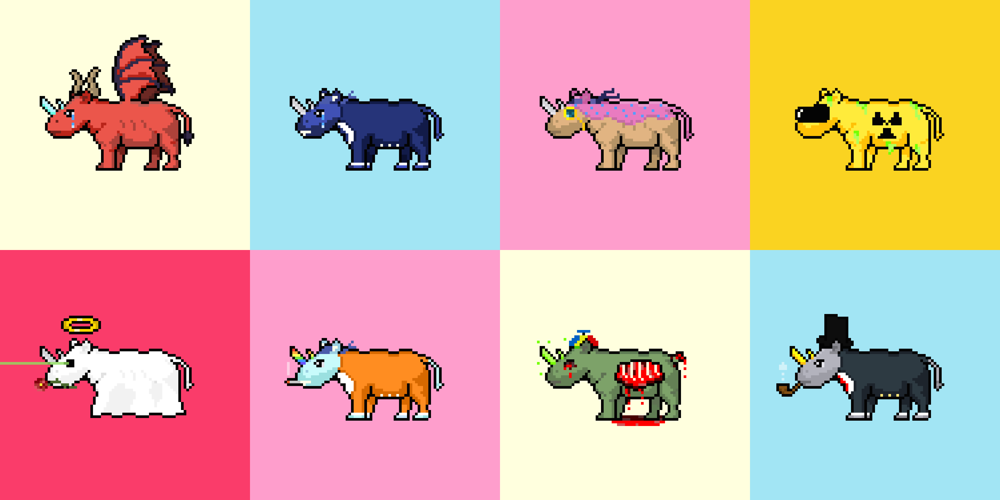

# Ridiculous Rhinos

Welcome to the source code repository for Ridiculous Rhinos! This repository contains the source code and all other publicly available information related to the Ridiculous Rhinos NFT collection.

Feel free to use this repository as a resource to create your own NFTs. This was a personal project, and while the original website and smart contract are no longer operational, the materials here can serve as a valuable reference for those interested in NFT development on the Ethereum blockchain.

## About Ridiculous Rhinos
Ridiculous Rhinos is an NFT collection built on the Ethereum blockchain. It showcases a unique set of Rhino-themed digital art pieces, each represented as a Non-Fungible Token (NFT).

### Key Features:
- Programmed in Solidity
- Compiled using Solidity version 0.8.7

## Repository Contents
This repository includes:
- Smart contract source code
- Documentation and guides
- Other relevant materials and links

All public information related to Ridiculous Rhinos will be maintained and updated in this repository.

## Learn More
For more information about this project and NFTs in general, feel free to explore the following resources:
- [Ridiculous Rhinos Official Website](https://ridiculousrhinos.club)
- [Ethereum Blockchain](https://ethereum.org)
- [Solidity Documentation](https://docs.soliditylang.org)
